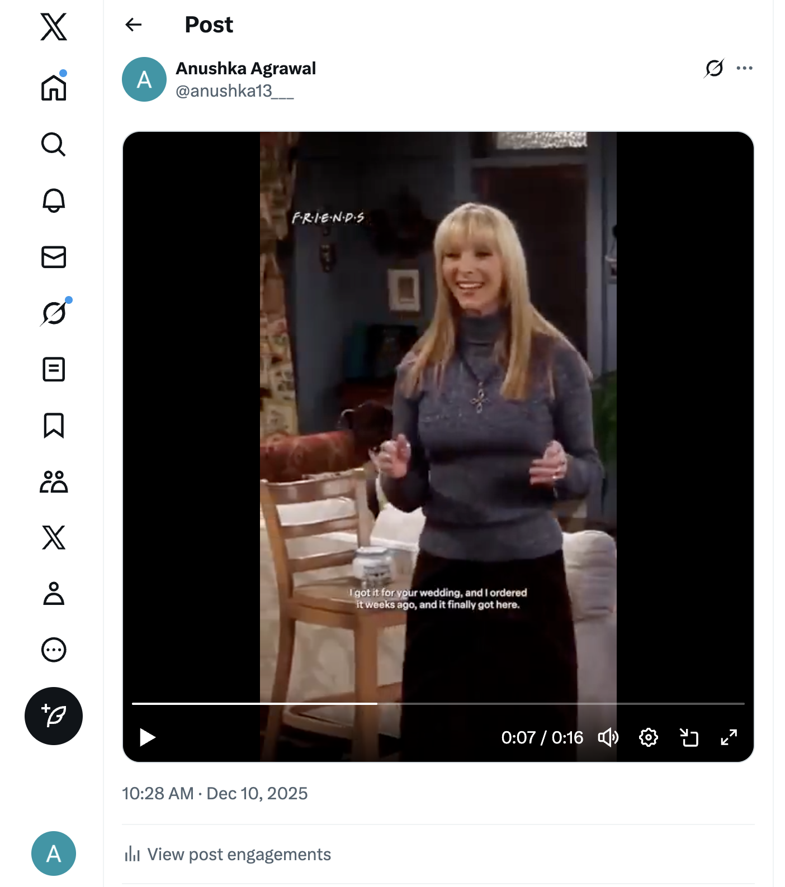
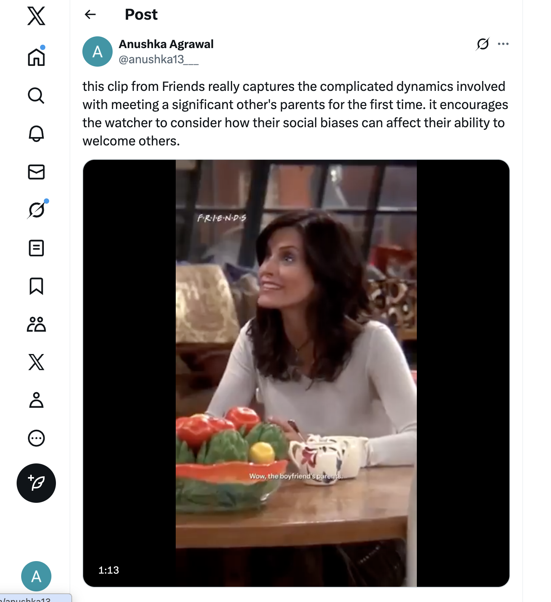
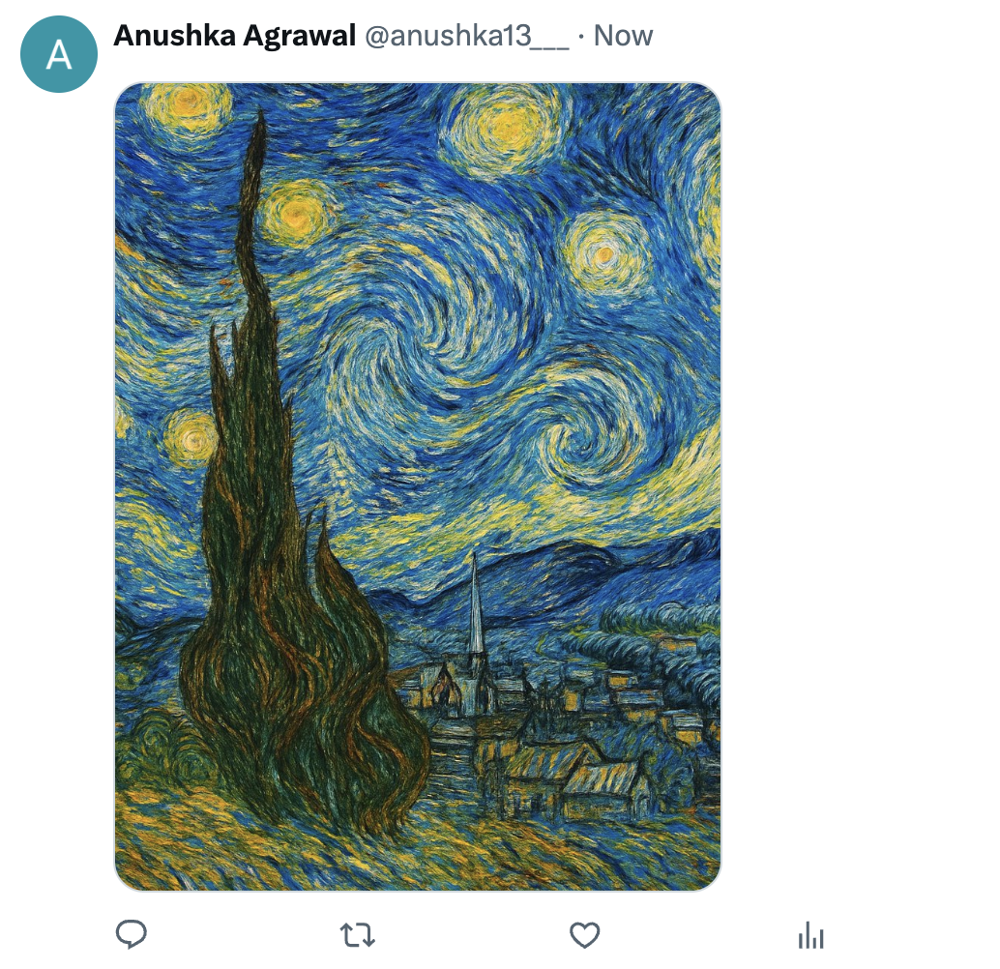
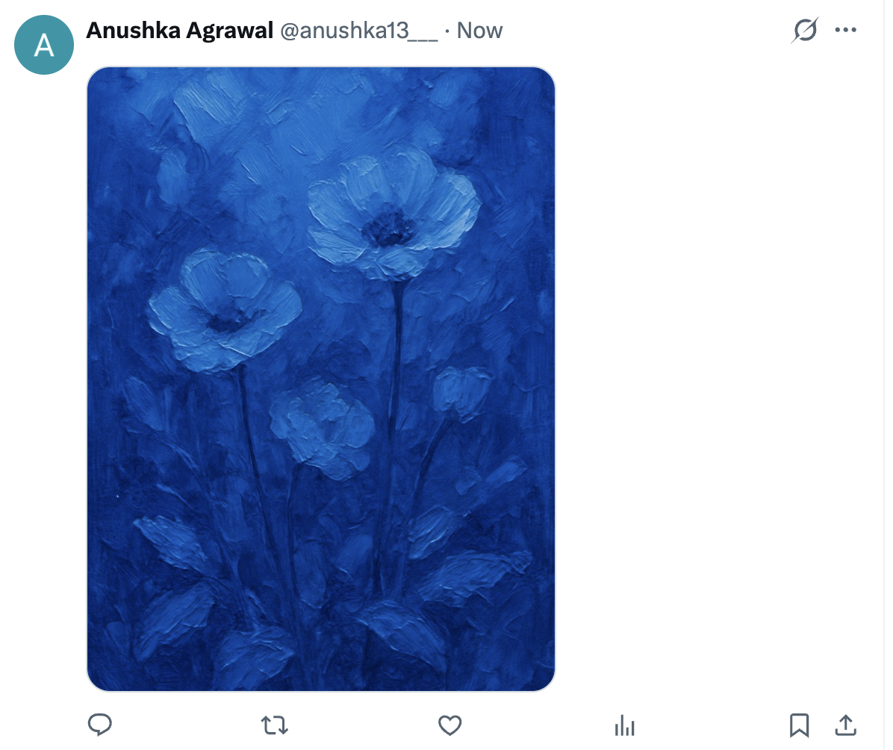

Anushka Agrawal
Security, Privacy, and Consumer Protection
Copyright  and Content Platforms

### Part 1: Copyright Policy Analysis
I’m choosing to focus on X for this assignment. I found information about their copyright policy on help.x.com. 

#### How does the platform detect copyrighted content? (automated systems like Content ID, manual reporting, etc.)
The platform primarily uses manual reporting to detect copyrighted content, relying on user-submitted DMCA complaints. They note that they will respond to reports of alleged copyright infringement, but that not all unauthorized uses of copyrighted materials are infringements, per fair use. 

#### What happens when content is flagged as potentially infringing?
When copyright complaints are filed, a user must submit their personal information and a statement indicating they believe that the use of the material is not authorized under copyright, as well as a statement that they are authorized to act on behalf of the copyright owner. X processes the claim and determines whether they should remove or disable access to the allegedly copyrighted material.

#### What is the appeals or counter-notification process?
If X receives a complaint and decides to remove or disable access to the material, they notify the affected user and provide them with a full copy of the report and instructions on how to file a counter-notice. The user will receive a copy of the complaint, the reporter’s full name, email, street address, and any other information included in the complaint. They can then submit a counter-notice to X or seek a retraction of the copyright complaint from the reporter. Submitting a counter-notice is the start of a legal process to reinstate the removed material, and requires submitting personal information and a statement under penalty of perjury that the material should not have been removed. Once submitted, a copy of the counter-notice is sent to the person who filed the original notice, who can pursue legal action if they disagree. 

#### How does the platform handle monetization of content containing copyrighted material?
Monetization of content is less relevant on X, since they have no ad revenue sharing like YouTube. Looking at X’s “Creator Monetization Standards” and “Rules for Content Monetization”, there are no references to content containing copyrighted material. Creators who monetize content containing copyrighted material are subject to the same user-submitted detection and appeals process as outlined above. 

#### Are there any special programs (e.g., YouTube's Content ID licensing agreements)?
X has no special programs like YouTube’s Content ID licensing. 

### Part 2: Fair Use Experiments
First, I uploaded a short segment (16 seconds) of copyrighted content with no modifications. I uploaded a clip from the show Friends downloaded, and provided no commentary on the clip. This content was never detected, and I never received any warnings, flags, copyright claims, or takedown notices. Ultimately, the content stayed up and no indication was given to me that it might be copyright infringement, despite being a raw copyrighted clip with no modifications. 
- Screenshot of successful upload: 
- Time until detection: never detected
- Screenshot of warnings: none
- Final outcome: content stays up
- Options presented: none

Second, I posted another clip from Friends, again with no editing, but this time with my own added commentary on how the scene does a good job of portraying complicated relationship dynamics. Again, the content was never detected, and I never received any warnings or takedown notices. The content ultimately stayed up with no indication that it could be copyright infringement. In this case, since I added my own analysis and criticism, this would be considered fair use of the clip.
- Screenshot of successful upload: 
- Time until detection: never detected
- Screenshot of warnings: none
- Final outcome: content stays up
- Options presented: none

### Part 3: AI-Generated Content Investigation
I used ChatGPT to generate content with similarity to copyrighted works.

First, I tried to ask for a direct reference to copyrighted material and for style mimicry using the prompts: 
"create an image of spiderman" and "create a portrait of spiderman in the style of Van Gogh". ChatGPT refused to generate this content because the requests did not adhere to their content policy. 

Instead I generated a more general form of style mimicry using ChatGPT. Again, there was no response from X that these might be copyright infringement or that they might need to be labeled as AI-generated.

- AI prompt: "create a painting in the style of van gogh"
- AI-generated output: 
- Platform response: none
- Research findings:
    - OpenAI gives you rights to use outputs, but you must comply with usage policies, such as posting no illegal content, no impersonation. I think copyright may fall under illegal content
    - Currently, AI-generated content in the U.S. isn't copyrightable because of the lack of "human authorship". You own it, per the tool's terms, but it has no copyright protection.
    - X requires labeling of AI-generated media in certain contexts. This includes political ads and synthetic media that could deceive.

As a baseline, I used AI to generate completely original content.

- AI prompt: "create a painting only using the color blue"
- AI-generated output: 
- Platform response: none
- Research findings: the same as above

### Part 4: Legal Analysis
#### Experiment 1: Raw 16-second Friends Clip

**Factor 1: Purpose and Character of Use**
- Non-transformative: no commentary, criticism, or new meaning added
- Simply reposting original content
- Non-commercial (no monetization on X).
- against fair use (not transformative despite being non-commercial)

**Factor 2: Nature of the Copyrighted Work**
- Highly creative work (fictional TV show)
    - Courts give more protection to creative works than factual works
- against fair use (creative work deserves strong protection)

**Factor 3: Amount and Substantiality Used**
- 16 seconds is a small portion quantitatively but may include 
  a significant moment. Short clips can be "substantial" if they capture the essence of the work
- could be for or against fair use, since it's a small amount used but could still be substantial

**Factor 4: Effect on Market**
-  Unlikely to substitute for the original work. A 10-second clip won't replace someone's desire to watch the TV show. However, widespread sharing could undermine licensing revenue for clips.
- probably not against fair use

**Overall Fair Use Assessment**: **Likely NOT fair use** - fails on transformativeness and creative nature factors

#### Experiment 2: Movie clip with critical commentary

**Factor 1: Purpose and Character of Use**
- transformative - adds new purpose (criticism/education) to original entertainment purpose
- commentary about cinematography/technique adds new meaning
- Non-commercial.
- fair use (classic transformative use)

**Factor 2: Nature of the Copyrighted Work**
- Creative work (fictional show), but criticism of creative works is a core fair use purpose 
- might be slightly against fair use, but criticism is protected

**Factor 3: Amount and Substantiality Used**
- only used what was necessary to make the critical point
- short clip
- fair use (reasonable amount for commentary purpose)

**Factor 4: Effect on Market**
- Criticism doesn't substitute for entertainment value
- No harm to licensing markets
- fair use (no market substitution)

**Overall Fair Use Assessment**: **fair use** - transformative purpose, reasonable use, no market harm

## Gap Analysis:
X's manual-only DMCA system creates a  gap between legal standards and actual enforcement. While fair use requires nuanced case-by-case analysis of four factors, and commentary/criticism are explicitly protected transformative uses, X doesn't proactively evaluate any of this. Both my raw clip (clearly not fair use) and my commentary clip (strong fair use) remained online with zero intervention. Enforcement only occurs if copyright holders manually file DMCA notices, meaning legally infringing content routinely stays up simply because rights holders can't monitor everything. This creates wildly inconsistent enforcement compared to platforms like YouTube, where Content ID automatically detects and addresses potential infringement within minutes.

The legal status of AI-generated content reveals another critical gap. U.S. Copyright Office guidance suggests purely AI-generated works may lack copyright protection due to insufficient human authorship, yet X has no policy distinguishing AI content from human-created content. All my AI-generated posts remained online without detection or intervention. Neither the platform nor current law provides clear frameworks for who bears liability when AI-generated content infringes, or how to handle AI's ability to mimic copyrighted styles. This leaves creators, platforms, and users operating without clear rules.

